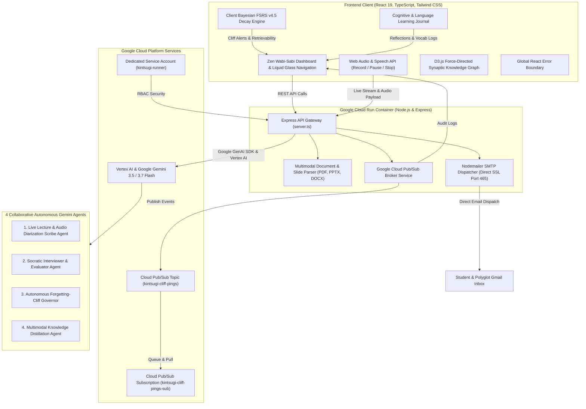

# 🏺 Kintsugi Memory (金継ぎ)
### Autonomous Forgetting-Cliff Partner for Universal Knowledge & Language Mastery

[](https://opensource.org/licenses/MIT)
[](https://cloud.google.com)
[](https://ai.google.dev)
[](https://kintsugi-memory-service-676289354133.us-west1.run.app/)

---

## 🏛️ The Kintsugi Philosophy: Proactive Cognitive Synthesis

In traditional spaced repetition systems (Anki, flashcard decks), software remains **passive**: it sits silent on your device waiting for you to open it. When daily schedules get busy, memory decay follows a steep biological power-law drop, frequently leading to the *illusion of competence* (passively re-reading notes instead of forced generative recall).

**Kintsugi Memory** is an **autonomous, proactive cognitive partner** inspired by the Japanese art of *Kintsugi* (金継ぎ — repairing broken ceramics with gold lacquer). In cognitive neuroscience, when a memory trace begins to destabilize at the **Forgetting Cliff (retention < 70%)**, forced active retrieval triggers synaptic protein synthesis (Long-Term Potentiation), leaving the neural trace stronger and more resilient than before.

### 🌟 What Makes Kintsugi Memory Autonomous:
1. **Continuous Bayesian FSRS Modeling**: Dynamically calculates memory stability $S$ and retrievability $R(t)$ for academic subjects, complex system architectures, and foreign language invariants.
2. **Proactive Forgetting-Cliff Telegrams**: When a memory vessel approaches the 70% retention boundary, the background governor dispatches a Socratic challenge directly to your Gmail inbox and browser alerts via **Google Cloud Pub/Sub**.
3. **Conversational Socratic Voice & Text Tutor**: Conducts interactive verbal and text dialogues, evaluates nuances, isolates misconceptions, and highlights the *Golden Insight* (the gold joinery).
4. **Live Lecture & Dialogue Scribe**: Listens to live lectures, conversations, or language classes with **Record / Pause / Resume / Stop** controls, aligning speech transcripts with slide decks (PDF, PPTX, DOCX) to distill atomic knowledge vessels.
5. **Cognitive & Polyglot Learning Journal**: Full markdown support for logging vocabulary nuance, grammar rules (such as the WEIRDO subjunctive rule), and audio reflections converted into active flashcards.
6. **Interactive D3.js Synaptic Knowledge Graph**: Force-directed network showing shared-tag bridges, memory density, and visual Kintsugi gold seams.

---

## 📐 System Architecture Diagram



---

## 🌐 Designed for Universal Learning & Polyglots

### 1. 🗣️ Language Acquisition & Polyglot Fluency
- **Vocabulary in Context**: Memorize words attached to cultural nuances and syntactic patterns.
- **Grammar Invariant Dissection**: Master subtle boundaries that trip up learners (e.g. Spanish Subjunctive WEIRDO rules, Japanese conditional particles, Mandarin directional complements).
- **Spoken Socratic Retrieval**: Practice speaking sentences aloud with real-time speech recognition and text-to-speech audio feedback.

### 2. 🎓 Academic & Engineering Concepts
- Distill distributed consensus (Raft, Paxos, 2PC), machine learning memory bounds (KV Cache, FlashAttention), neurobiology of memory, and quantum systems into atomic vessels.

### 3. 📖 Universal Document & Audio Ingestion
- Upload PDF research papers, PowerPoint slide decks (`.pptx`), Word documents (`.docx`), whiteboard photos, or live recorded lectures (`.mp3`, `.wav`, `.m4a`, `.webm`).

---

## ⚡ Core Platform Capabilities

| Feature | Description |
|---|---|
| **🎙️ Live Scribe Studio** | Record lectures or language conversations with **Record**, **Pause / Resume**, and **Stop & Finalize** controls. Extracts speaker-diarized transcripts and slide alignments. |
| **📬 Autonomous Cliff Governor** | Background agent calculating Bayesian FSRS decay $R(t) = (1 + \text{factor} \cdot \frac{t}{S})^{-d}$. Dispatches email alerts when retrievability drops to 70%. |
| **🥋 Socratic Voice Tutor** | Verbal retrieval sessions evaluating accuracy, isolating misconceptions, and delivering *Golden Insights*. |
| **📔 Cognitive Journal** | Full reflective space for logging language grammar rules, sentence formulations, and daily synaptic breakthroughs. |
| **🕸️ D3 Synaptic Knowledge Graph** | Interactive, force-directed graph visualizing concept stability, inter-concept links, and forgetting risks with smooth reset zoom controls. |
| **🔥 Synaptic Streak Continuum** | Power-law streak tracking, milestone rewards, and interactive 7-day practice calendar. |

---

## 🚀 Personal Deployment & Setup Guide

### Option 1: Local Development (Fastest)

#### 1. Clone & Install Dependencies
```bash
git clone https://github.com/rafifernandaa/kintsugi-memory.git
cd kintsugi-memory
npm install
```

#### 2. Configure `.env`
```bash
cp .env.example .env
```

Edit your `.env`:
```env
PORT=3000
GEMINI_API_KEY=your-gemini-api-key-here
GOOGLE_CLOUD_PROJECT=your-google-cloud-project-id
GOOGLE_CLOUD_PUBSUB_TOPIC=projects/your-google-cloud-project-id/topics/kintsugi-cliff-pings
GOOGLE_CLOUD_PUBSUB_SUBSCRIPTION=kintsugi-cliff-pings-sub

# Optional: Real Gmail Delivery (can also be configured directly inside the web UI)
SMTP_USER=your-email@gmail.com
SMTP_PASS=your-16-char-google-app-password
```

#### 3. Start Application
```bash
# Production Build & Run
npm run build
npm start

# Or for hot-reloading dev mode:
npm run dev
```

Visit `http://localhost:3000` in your browser.

---

### Option 2: Google Cloud Run Deployment

#### Automated Shell Deployment:
```bash
# Linux / macOS
./deploy-cloudrun.sh

# Windows PowerShell
./deploy-cloudrun.ps1
```

The script automatically:
1. Enables Cloud Run, Artifact Registry, Pub/Sub, and Vertex AI APIs.
2. Builds the container image via Google Cloud Build.
3. Provisions Cloud Pub/Sub topics and dead-letter queues.
4. Deploys the service with autoscaling to Google Cloud Run.

---

## 🛡️ Security & Privacy

- **Safe Credential Management**: User API keys and SMTP credentials can be configured at runtime and stored locally in browser storage or encrypted environment variables.
- **Zero Raw Key Leakage**: Keys are never transmitted in telemetry logs or client bundles.
- **Dedicated Service Account**: Runs under the least-privilege `kintsugi-runner` IAM role in Google Cloud.

---

## 📜 License

MIT License — Copyright (c) 2026 Kintsugi Memory.
Permission is hereby granted, free of charge, to any person obtaining a copy of this software and associated documentation files.
