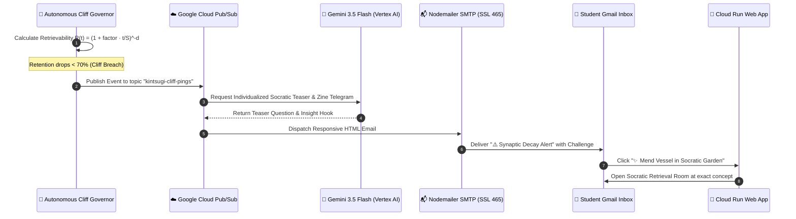
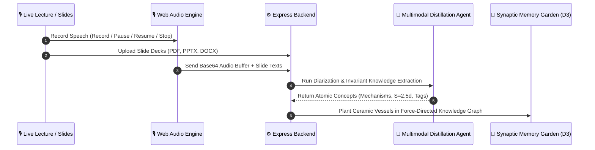
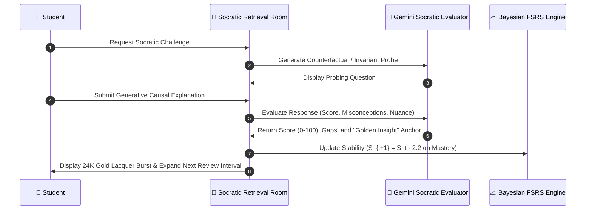

# 🏺 Kintsugi Memory (金継ぎ)
### Autonomous Forgetting-Cliff Partner for Universal Knowledge & Language Mastery

[](https://opensource.org/licenses/MIT)
[](https://cloud.google.com)
[](https://ai.google.dev)
[](https://kintsugi-memory-service-676289354133.us-west1.run.app/)

---

## 🏛️ Executive Summary: Why Kintsugi Memory?

In traditional spaced repetition systems (Anki, flashcards), software is **passive**: it sits silent on your device waiting for you to open it. As daily schedules get busy, memory decay follows a steep biological power-law drop, leading to the *illusion of competence* (passively re-reading notes instead of forced generative recall).

**Kintsugi Memory** is an **autonomous, proactive cognitive partner** inspired by the Japanese art of *Kintsugi* (金継ぎ — repairing broken ceramics with gold lacquer). In cognitive neuroscience, when a memory trace destabilizes at the **Forgetting Cliff (retention < 70%)**, forced active retrieval triggers synaptic protein synthesis (Long-Term Potentiation), leaving the neural trace stronger and more resilient than before.

```
                  TRADITIONAL PASSIVE FLASHCARDS vs. KINTSUGI AUTONOMOUS PARTNER
┌───────────────────────────────────────────────────┬───────────────────────────────────────────────────┐
│ ❌ Traditional Passive Spaced Repetition          │ 🌸 Kintsugi Autonomous Partner (Google Cloud)     │
├───────────────────────────────────────────────────┼───────────────────────────────────────────────────┤
│ • Sits silently waiting for user to open app      │ • Asynchronously calculates decay; pings Gmail    │
│ • Superficial Multiple Choice (recognition only)  │ • Generative Socratic inquiry (causal recall)     │
│ • Static linear intervals (1d, 3d, 7d)            │ • Adaptive Bayesian FSRS half-life parameter math │
│ • Plain text flashcards typed manually            │ • Multimodal live audio recording & slide OCR     │
│ • No misconception isolation                      │ • Identifies cognitive gaps & seals "Gold Seams"  │
└───────────────────────────────────────────────────┴───────────────────────────────────────────────────┘
```

---

## 📐 System Architecture & Component Topology


---

## ⚡ End-to-End Execution Paths

### 1. The Autonomous Forgetting-Cliff Pipeline (Asynchronous Trigger)


---

### 2. Multimodal Ingestion & Live Scribe Pipeline


---

### 3. Socratic Active Retrieval & Golden Joinery Pipeline


---

## 🗂️ Repository Folder Structure

```
kintsugi-memory/
├── server.ts                     # Express API Gateway, SSR server & REST endpoints
├── server/
│   ├── geminiService.ts          # Vertex AI / Gemini 3.5 & 3.7 Flash Client integrations
│   ├── googleAgentFramework.ts   # 4-Agent collaborative framework (Scribe, Socratic, Governor, Distiller)
│   ├── pubsubService.ts          # Cloud Pub/Sub publisher, subscriber & HTML email engine
│   └── speechService.ts          # Multimodal audio diarization & speech transcription
├── src/
│   ├── App.tsx                   # Main React entry point, tab state & routing
│   ├── components/
│   │   ├── LandingPage.tsx       # Liquid glass landing sanctuary & mending cycle showcase
│   │   ├── DashboardHome.tsx     # Sanctuary dashboard, streak continuum & quick action hub
│   │   ├── ActiveRetrievalRoom.tsx # Socratic dialogue arena, timer, TTS & Golden Seam renderer
│   │   ├── MemoryGarden.tsx      # Ceramic vessel gallery, decay filters & inspection modal
│   │   ├── CognitiveJournal.tsx  # Markdown reflection notebook & 1-click flashcard converter
│   │   ├── MaterialsHub.tsx      # Multimodal ingestion center & Live Scribe studio
│   │   ├── SynapticForceGraph.tsx# D3.js force-directed knowledge network with reset zoom
│   │   ├── AutonomousDispatcher.tsx # Pub/Sub decay testing & automated ping simulation
│   │   ├── RetentionOracle.tsx   # Bayesian FSRS mathematical retention curve visualizer
│   │   └── UserAccountSettings.tsx # Secure runtime API key & Gmail SMTP configuration
│   ├── lib/
│   │   └── fsrs.ts               # Bayesian Free Spaced Repetition Scheduler (v4.5) algorithms
│   └── types/                    # Full TypeScript interface definitions & domain models
├── deploy-cloudrun.sh            # Automated Linux/macOS Google Cloud Run deployment script
├── deploy-cloudrun.ps1           # Automated Windows PowerShell deployment script
├── Dockerfile                    # Multi-stage production container build (Node.js 22 LTS)
└── README.md                     # Comprehensive architecture, topology & operational manual
```

---

## 🧰 Full Technology Stack

| Layer | Technologies | Role & Implementation |
|---|---|---|
| **AI & LLM Engines** | **Google Gemini 3.5 Flash** & **Gemini 3.7 Flash** | Multimodal audio diarization, document synthesis, counterfactual Socratic questioning, and misconception extraction. |
| **Compute & Hosting** | **Google Cloud Run** (`us-west1`) | Serverless container auto-scaling hosting Express + Vite SSR backend. |
| **Async Messaging** | **Google Cloud Pub/Sub** | High-throughput event topic (`kintsugi-cliff-pings`) and subscriber worker for background forgetting-cliff alerts. |
| **Model Gateway** | **Google Vertex AI** (`global`) | Enterprise Gemini model routing with token security and low-latency inference. |
| **Security & IAM** | **GCP IAM Service Account** (`kintsugi-runner`) | Least-privilege role binding for Pub/Sub publishing and Vertex AI execution. |
| **Frontend Framework** | **React 19**, **TypeScript 5**, **Tailwind CSS 4** | Zen Wabi-Sabi aesthetic with liquid glassmorphism, responsive viewports, and zero layout shift. |
| **Data Visualization** | **D3.js (Force Simulation v7)** | Dynamic force-directed network displaying concept stability, inter-concept links, and golden seams. |
| **Audio & Speech** | **Web Audio API** & **Web Speech API** | In-browser speech synthesis (TTS), live microphone recording with chunked base64 buffering. |
| **Spaced Repetition** | **Bayesian FSRS v4.5** | Mathematical power-law memory modeling: $R(t) = (1 + \text{factor} \cdot \frac{t}{S})^{-d}$. |
| **Email Transport** | **Nodemailer (Direct SSL Port 465)** | Automated responsive HTML email dispatcher with direct action buttons. |

---

## 🛡️ Edge Cases & Resilience Engineering (Beyond the Demo Video)

The 4-minute video focuses on the primary user journey; the following production safeguards are built directly into the codebase:

1. **Floating-Point Stability Bounds**:
   - Spaced repetition calculations can produce floating-point noise (e.g. $1.3 \times 2.0 = 2.5999999999999996$). All stability assignments and UI templates enforce `Number(val.toFixed(1))` to guarantee clean, readable metrics.
2. **Off-Topic & Divergent Answer Guard**:
   - If a student submits an answer that ignores the causal constraints of the concept, Gemini isolates the response as `off_topic`. The system prevents unearned stability growth and presents a guidance banner to re-anchor understanding.
3. **Live Microphone Interruption Resilience**:
   - The Live Scribe Studio uses a state machine supporting **Record $\to$ Pause $\to$ Resume $\to$ Stop**. Audio data is stored in chunked base64 buffers to prevent memory leaks or audio loss during extended lectures.
4. **D3.js Viewport Zoom Persistence**:
   - Zoom transforms are attached to a persistent `zoomBehaviorRef`, ensuring that clicking **"Reset View"** smoothly animates back to `d3.zoomIdentity` without losing SVG coordinate sync.
5. **Direct SSL SMTP Port 465 Fallback**:
   - Many cloud hosting platforms restrict outbound port 25 or intercept port 587. Kintsugi Memory defaults to secure Direct SSL (Port 465) with exponential backoff retries.
6. **Graceful Offline & Fallback Modes**:
   - If Cloud Pub/Sub or Vertex AI credentials are unconfigured during local development, the backend automatically transitions to an in-memory event simulation queue with full audit logging.

---

## 🚀 Quickstart & Local Setup

### 1. Clone & Install
```bash
git clone https://github.com/rafifernandaa/kintsugi-memory.git
cd kintsugi-memory
npm install
```

### 2. Configure Environment (`.env`)
```bash
cp .env.example .env
```
Edit your `.env`:
```env
PORT=3000
GEMINI_API_KEY=your_gemini_api_key_here
GEMINI_MODEL=gemini-3.5-flash

GOOGLE_CLOUD_PROJECT=your-google-cloud-project-id
GOOGLE_CLOUD_PUBSUB_TOPIC=projects/your-google-cloud-project-id/topics/kintsugi-cliff-pings
GOOGLE_CLOUD_PUBSUB_SUBSCRIPTION=kintsugi-cliff-pings-sub

# Optional: Real Gmail Delivery (can also be configured inside the web UI)
SMTP_USER=your-email@gmail.com
SMTP_PASS=your-16-char-google-app-password
```

### 3. Build & Run
```bash
# Production Build & Run
npm run build
npm start

# Hot-Reloading Development Mode
npm run dev
```
Open `http://localhost:3000` in your browser.

---

## ☁️ Google Cloud Run Deployment

Deploy with a single command using the automated scripts:

```bash
# Linux / macOS
./deploy-cloudrun.sh

# Windows PowerShell
./deploy-cloudrun.ps1
```

The script automatically:
1. Enables Cloud Run, Artifact Registry, Cloud Pub/Sub, and Vertex AI APIs.
2. Builds the container image via Google Cloud Build.
3. Provisions Cloud Pub/Sub topics (`kintsugi-cliff-pings`) and subscriptions.
4. Deploys the service with autoscaling to Google Cloud Run in `us-west1`.

---

## 📜 License

MIT License — Copyright (c) 2026 Kintsugi Memory.  
Created with 🌸 for the Google Cloud: All Things Agentic Hackathon.
