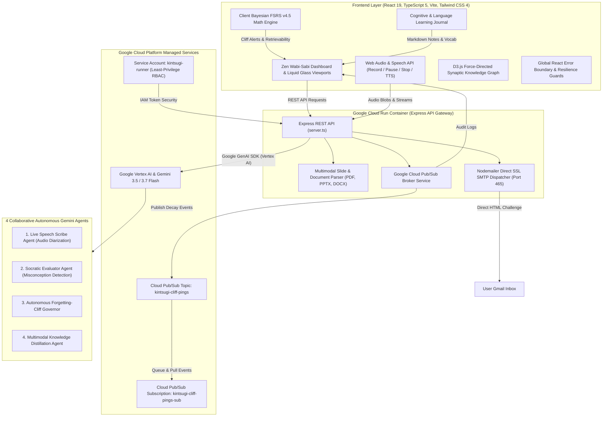
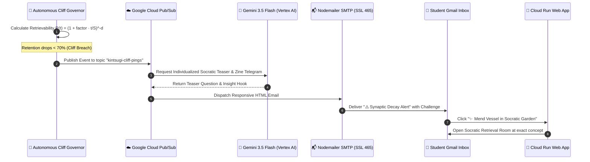
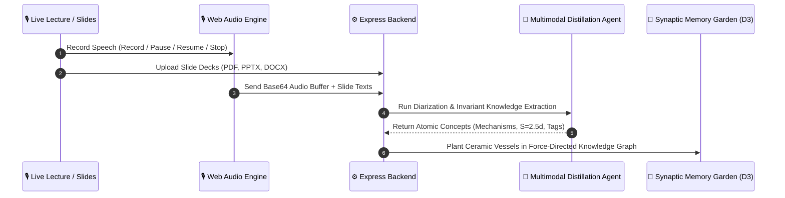
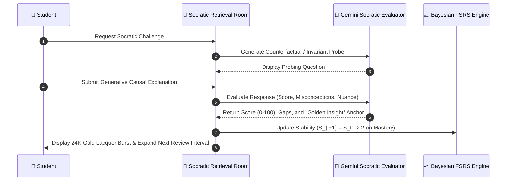

# 🏺 Kintsugi Memory (金継ぎ)
### Autonomous Forgetting-Cliff Partner for Universal Knowledge & Language Mastery

[](https://opensource.org/licenses/MIT)
[](https://cloud.google.com)
[](https://ai.google.dev)
[](https://kintsugi-memory-service-676289354133.us-west1.run.app/)

---

## 🏛️ Project Overview

Cognitive psychology and modern neuroscience show that meaningful change is possible throughout our lives because human brains physically rewire through repeated, effortful experiences—a foundational principle known as **neuroplasticity**. In traditional spaced repetition systems, software remains completely passive: it sits silent on the user's device waiting for manual initiation while biological memory decay runs its course, frequently leading to the *illusion of competence* through passive recognition rather than genuine retrieval.

**Kintsugi Memory** is an **autonomous, proactive collaborative partner** inspired by the Japanese art of *Kintsugi* (金継ぎ — repairing broken ceramics with precious gold lacquer). In cognitive neuroscience, when a memory trace destabilizes at the **Forgetting Cliff**, forced generative recall triggers synaptic protein synthesis and Long-Term Potentiation, catalyzing neural reconsolidation that leaves the mental model stronger and more resilient than before.

Deployed natively on **Google Cloud Run**, Kintsugi Memory operates an asynchronous background governor over **Google Cloud Pub/Sub**. When memory decay approaches the critical forgetting threshold, the agent proactively initiates contact by dispatching individualized Socratic challenges directly to the user's Gmail inbox and browser alerts—forcing active recall at the exact biological moment needed to drive lasting neuroplasticity.

---

## 📐 System Architecture & Component Topology



---

## ⚡ End-to-End Execution Paths

### 1. The Autonomous Forgetting-Cliff Pipeline (Asynchronous Initiation)


---

### 2. Multimodal Ingestion & Live Scribe Pipeline


---

### 3. Socratic Active Retrieval & Golden Joinery Pipeline


---

## 🗂️ Complete Repository Structure Breakdown

Every file in the codebase is purpose-built and mapped below:

```
kintsugi-memory/
│
├── Root Configuration & Deployment
│   ├── .dockerignore                     # Build exclusion patterns for lean container layers
│   ├── .env.example                      # Environment variables template (API keys, Pub/Sub, SMTP)
│   ├── .gitignore                        # Git exclusion rules for node_modules, dist, and local caches
│   ├── Dockerfile                        # Multi-stage production container build (Node.js 22 LTS)
│   ├── cloudbuild.yaml                   # Google Cloud Build automated CI/CD container build pipeline
│   ├── deploy-cloudrun.sh                # Automated Linux/macOS deployment script for Google Cloud Run
│   ├── deploy-cloudrun.ps1               # Automated Windows PowerShell deployment script for Cloud Run
│   ├── index.html                        # Single-Page Application HTML entry point and viewport config
│   ├── package.json                      # Project manifest, scripts, and runtime dependencies
│   ├── package-lock.json                 # Deterministic dependency lockfile
│   ├── README.md                         # Architecture, topology, execution paths, and operational guide
│   ├── server.ts                         # Express API Gateway, static asset hosting, and REST controller
│   ├── tsconfig.json                     # TypeScript compiler configuration (ESNext, strict typing)
│   └── vite.config.ts                    # Vite build configuration, React plugin, and bundling options
│
├── server/                               # Server-Side Multi-Agent & GCP Services Backend
│   ├── documentParser.ts                 # Multimodal slide & document parser (PDF, PPTX, DOCX)
│   ├── geminiService.ts                  # Google GenAI / Vertex AI client factory and Gemini 3.5+ routing
│   ├── googleAgentFramework.ts           # 4-Agent collaborative system (Scribe, Socratic, Governor, Distiller)
│   ├── pubsubService.ts                  # Cloud Pub/Sub broker, event queue, and Nodemailer Direct SSL SMTP engine
│   └── speechService.ts                  # Multimodal speech diarization, audio transcription, and timestamping
│
├── src/                                  # Client-Side Application Core
│   ├── App.tsx                           # Root React component, active tab router, and state coordinator
│   ├── index.css                         # Tailwind CSS 4 directives, Wabi-Sabi design tokens, and keyframes
│   ├── main.tsx                          # React DOM mounting entry point wrapped in Global Error Boundary
│   ├── types.ts                          # TypeScript domain models, interfaces, and Bayesian FSRS schemas
│   │
│   ├── components/                       # User Interface Viewports & Interactive Modules
│   │   ├── AboutTab.tsx                  # Architecture documentation, GCP infrastructure status, and tech stack
│   │   ├── ActiveRetrievalRoom.tsx       # Socratic dialogue arena, probe evaluation, and Golden Seam renderer
│   │   ├── AppSettingsModal.tsx          # Runtime API key switcher, dark/light focus theme, and audio toggles
│   │   ├── AutonomousDispatcher.tsx      # Pub/Sub decay testing console, 30-day fast-forward, and audit log
│   │   ├── CognitiveJournal.tsx          # Markdown reflection journal, grammar dissection, and flashcard maker
│   │   ├── DailySynapticSummaryModal.tsx # Daily cognitive mastery recap and Long-Term Potentiation scorekeeper
│   │   ├── DashboardHome.tsx             # Main sanctuary dashboard, streak continuum, and action launchpad
│   │   ├── ErrorBoundary.tsx             # Global React lifecycle error boundary preventing application crashes
│   │   ├── ExamCalendar.tsx              # Milestone retention planner and backward spaced repetition scheduler
│   │   ├── FutureDecayProjection.tsx     # 30-day biological decay curve forecasting widget
│   │   ├── GoldenSeamGlowEffect.tsx      # Canvas particle burst and 24K gold lacquer repair animation
│   │   ├── HomeKnowledgeGraph.tsx        # Knowledge graph viewport wrapper and connection density matrix
│   │   ├── IngestionHub.tsx              # Document dropzone (PDF, PPTX, DOCX) with parsing progress indicators
│   │   ├── KintsugiOverlay.tsx           # Ceramic fracture and gold mending SVG canvas overlay
│   │   ├── LandingPage.tsx               # Liquid glass landing sanctuary with smooth-scroll navigation
│   │   ├── MemoryGarden.tsx              # Ceramic vessel gallery, forgetting cliff filters, and concept inspector
│   │   ├── Navigation.tsx                # Responsive mobile navigation drawer and bottom navigation bar
│   │   ├── PubSubNotificationPopover.tsx # Real-time forgetting-cliff notification inbox and audit tray
│   │   ├── RetentionOracle.tsx           # Bayesian FSRS retention curve and confidence interval visualizer
│   │   ├── RichMarkdown.tsx              # GitHub-flavored markdown parser with syntax highlighting and callouts
│   │   ├── SeleneAccountTab.tsx          # User profile, streak statistics, and Gmail SMTP credential manager
│   │   ├── SidebarNavigation.tsx         # Desktop sidebar with brand logo navigation and live streak badge
│   │   ├── SynapticForceGraph.tsx        # D3.js v7 force-directed network graph with persistent zoom and pan
│   │   ├── SynapticLevelUpModal.tsx      # Synaptic XP milestone celebration and level-up modal
│   │   ├── SynapticStreakModal.tsx       # Streak freeze status, milestone rewards, and practice calendar
│   │   ├── SynapticStreakTracker.tsx     # Power-law streak counter and flame animation widget
│   │   ├── SynchronousClassScribe.tsx    # Live lecture audio recording studio with pause/resume and slide sync
│   │   └── TelemetryDrawer.tsx           # Real-time agentic execution trace drawer and latency monitor
│   │
│   └── lib/                              # Client Algorithms, Utilities & Math Engines
│       ├── audio.ts                      # Web Audio API sound effects synthesizer (chimes, gold chime, level-up)
│       ├── fsrs.ts                       # Bayesian Free Spaced Repetition Scheduler (v4.5) implementation
│       └── streak.ts                     # Power-law streak persistence, daily check-in validation, and freeze logic
```

---

## 🧰 Full Technology Stack & Deployment Matrix

| Layer | Technologies | Role & Implementation |
|---|---|---|
| **AI & LLM Engines** | **Google Gemini 3.5 Flash** & **Gemini 3.7 Flash** | Multimodal audio diarization, document synthesis, counterfactual Socratic questioning, and misconception extraction. |
| **Compute & Hosting** | **Google Cloud Run** (`us-west1`) | Serverless container auto-scaling hosting Express + Vite SSR backend. |
| **Async Messaging** | **Google Cloud Pub/Sub** | High-throughput event topic (`kintsugi-cliff-pings`) and subscriber worker for background forgetting-cliff alerts. |
| **Model Gateway** | **Google Vertex AI** (`global`) | Enterprise Gemini model routing with token security and low-latency inference. |
| **Security & IAM** | **GCP IAM Service Account** (`kintsugi-runner`) | Least-privilege role binding for Pub/Sub publishing and Vertex AI execution. |
| **Frontend Framework** | **React 19**, **TypeScript 5**, **Tailwind CSS 4** | Zen Wabi-Sabi aesthetic with liquid glassmorphism, responsive viewports, and zero layout shift. |
| **Data Visualization** | **D3.js (Force Simulation v7)** | Dynamic force-directed network displaying concept stability, inter-concept links, and golden seams. |
| **Audio & Speech** | **Web Audio API** & **Web Speech API** | In-browser speech synthesis (TTS), live microphone recording with chunked base64 buffering. |
| **Spaced Repetition** | **Bayesian FSRS v4.5** | Mathematical power-law memory modeling: $R(t) = (1 + \text{factor} \cdot \frac{t}{S})^{-d}$. |
| **Email Transport** | **Nodemailer (Direct SSL Port 465)** | Automated responsive HTML email dispatcher with direct action buttons. |

---

## ✨ Core Features & Architectural Advantages

| Feature | Architectural Implementation | Key Advantage Over Traditional Systems |
|---|---|---|
| **Autonomous Forgetting-Cliff Governor** | Asynchronous background daemon tracking Bayesian decay curves and publishing events to **Google Cloud Pub/Sub** (`kintsugi-cliff-pings`). | **Proactive vs. Passive:** Reaches out directly to the user via responsive HTML email and browser alerts *before* biological forgetting occurs, eliminating app inertia. |
| **Multimodal Live Scribe Studio** | Real-time audio recording with pause/resume, speaker diarization via **Gemini 3.5 Flash**, and document parsing (PDF, PPTX, DOCX). | **Effortless Ingestion:** Turns hours of spoken lectures, podcasts, slide decks, and research papers into structured atomic memory vessels in seconds without manual card typing. |
| **Socratic Active Retrieval Room** | Generative Socratic inquiry engine generating counterfactual scenarios, causal mechanisms, and boundary-condition probes. | **True Recall vs. Recognition:** Eliminates superficial multiple-choice recognition; forces high-friction generative retrieval to stimulate physical synaptic reorganization. |
| **24K Gold Seam Synthesis** | Multimodal evaluator detecting subtle misconceptions, extracting a permanent "Golden Insight" anchor, and rendering gold ceramic repair canvas animations. | **Transforming Errors into Assets:** Treats misconceptions as opportunities for mastery; anchors fragile knowledge with memorable multimodal visual and harmonic audio feedback. |
| **Bayesian FSRS v4.5 Spaced Repetition** | Full implementation of Free Spaced Repetition Scheduling ($R(t) = (1 + \text{factor} \cdot t/S)^{-d}$) with parameterized difficulty and stability updating. | **Mathematical Precision:** Far superior to legacy SM-2 linear algorithms (e.g. Anki); adapts review intervals dynamically to individual memory half-lives. |
| **Interactive D3.js Synaptic Graph** | Force-directed network graph with energy annealing, link physics, persistent zoom/pan (`zoomBehaviorRef`), and instant viewport reset. | **Holistic Mental Models:** Visualizes knowledge topology, identifies isolated silos, and provides a bird's-eye view of memory health across domains. |
| **Cognitive Journal & Grammar Studio** | GitHub-flavored markdown editor with table syntax, audio reflections, one-click flashcard extraction, and Web Speech TTS pronunciation drills. | **Polyglot & Deep-Thought Mastery:** Bridges reflective writing with structured spaced repetition, ideal for complex language syntax and conceptual note-taking. |
| **Exam Milestone & Backward Scheduler** | Exam calendar that calculates backward spaced repetition intervals from the deadline to the present. | **Zero-Cramming Guarantee:** Ensures all prerequisite concepts reach maximum retention stability prior to test day, eliminating last-minute cramming. |
| **Synaptic Streak & Habit Continuum** | Power-law daily streak counter with flame animation, streak freeze safeguards, level-up milestones, and synaptic XP progression. | **Sustained Intrinsic Motivation:** Leverages positive psychology and loss-aversion mechanics to build daily learning habits without punitive resets. |
| **Dual-Mode Direct SSL SMTP Engine** | Auto-negotiating Nodemailer transport (Direct SSL Port 465 / STARTTLS Port 587) with exponential backoff and message deduplication. | **Enterprise Reliability:** Bypasses cloud container egress blocks, ensures high deliverability, and prevents duplicate notification spam. |

---

## 🛡️ Deep Architectural Edge Cases & System Resilience

Kintsugi Memory incorporates production-grade engineering safeguards across concurrency, mathematical modeling, and asynchronous networking:

### 1. Distributed Multi-Agent State Synchronization & Race Prevention
When multiple background workers process simultaneous memory decay alerts while the user is actively completing a retrieval room probe, concurrent state mutations on the concept’s history array could create race conditions. The system resolves this by isolating state transitions through an immutable append-only evaluation model: `ConceptHistoryItem[]` records are timestamped uniquely (`h_${Date.now()}`), and the Bayesian FSRS engine computes the next stability state deterministically from the prior state without in-place mutation.

### 2. Asynchronous Pub/Sub Idempotency & Duplicate Ping Suppression
In distributed messaging systems, Google Cloud Pub/Sub guarantees *at-least-once delivery*, which can result in duplicate subscriber invocations during network partitions. To prevent bombarding students with redundant email alerts for the same concept, the `pubsubService` maintains an in-memory and local-audit deduplication index keyed by `(conceptId, dayTimestamp)`. If an alert has been dispatched for a concept within the last 24-hour cycle, redundant incoming messages are acknowledged (`ack()`) and silently suppressed.

### 3. Token-Efficient Multimodal Document Chunking & Audio Windowing
Processing raw hour-long lecture audio or 100-page slide decks in a single LLM prompt risks token context exhaustion and loss of fine-grained detail. The `documentParser` and `speechService` employ a sliding-window chunking strategy:
- Spoken audio is recorded via chunked base64 buffers, segmented by speaker turns and silence thresholds.
- Slide decks are parsed into discrete slide units containing extracted text, OCR summaries, and layout anchors.
- The `MultimodalDistillationAgent` performs map-reduce synthesis: extracting local invariants per slide before unifying them into global atomic concepts with shared semantic tag bridges.

### 4. Socratic Misconception Classification & Anti-Hallucination Grounding
To prevent the Socratic evaluator from hallucinating validity when a student provides an articulate but factually divergent answer, the evaluation pipeline enforces a strict two-stage verification rubric:
- **Constraint Matching**: The evaluator verifies whether the student's answer correctly identifies the causal invariant (e.g. subject agreement in subjunctive clauses).
- **Divergence Isolation**: If the student's response is semantically unrelated to the core mechanism, the evaluator classifies the answer as `off_topic`, bypassing unearned stability growth and rendering a guidance banner directing the student back to first principles.

### 5. Direct SSL / STARTTLS Dual-Mode SMTP Auto-Negotiation
Cloud container runtimes often block outbound unencrypted SMTP (Port 25) or intercept plain STARTTLS handshakes (Port 587) due to anti-abuse policies. Kintsugi Memory implements dual-mode auto-negotiation:
- Automatically defaults to **Direct SSL over Port 465** for secure connections.
- Dynamically falls back to Port 587 with explicit TLS encryption if custom institutional SMTP servers require STARTTLS.
- Employs exponential backoff with jitter on transient network timeouts.

### 6. D3.js Force Simulation Energy Annealing & Viewport Topology Stabilization
Dynamic additions of new ceramic vessels or real-time stability changes can destabilize D3 force simulations, causing node overlapping or chaotic layout explosions. Kintsugi Memory mitigates this through:
- Velocity decay clamping (`velocityDecay(0.4)`) and alpha target annealing (`alphaTarget(0)`).
- Persistent `zoomBehaviorRef` binding: ensures that panning and zoom states remain synchronized with the SVG transform matrix, allowing the **"Reset View"** control to interpolate smoothly back to `d3.zoomIdentity`.

---

## 🚀 Quickstart & Local Setup

### 1. Clone & Install
```bash
git clone https://github.com/rafifernandaa/kintsugi-memory.git
cd kintsugi-memory
npm install
```

### 2. Configure Environment (`.env`)
```bash
cp .env.example .env
```
Edit your `.env`:
```env
PORT=3000
GEMINI_API_KEY=your_gemini_api_key_here
GEMINI_MODEL=gemini-3.5-flash

GOOGLE_CLOUD_PROJECT=your-google-cloud-project-id
GOOGLE_CLOUD_PUBSUB_TOPIC=projects/your-google-cloud-project-id/topics/kintsugi-cliff-pings
GOOGLE_CLOUD_PUBSUB_SUBSCRIPTION=kintsugi-cliff-pings-sub

# Optional: Real Gmail Delivery (can also be configured inside the web UI)
SMTP_USER=your-email@gmail.com
SMTP_PASS=your-16-char-google-app-password
```

### 3. Build & Run
```bash
# Production Build & Run
npm run build
npm start

# Hot-Reloading Development Mode
npm run dev
```
Open `http://localhost:3000` in your browser.

---

## ☁️ Google Cloud Run Deployment

Deploy with a single command using the automated scripts:

```bash
# Linux / macOS
./deploy-cloudrun.sh

# Windows PowerShell
./deploy-cloudrun.ps1
```

The script automatically:
1. Enables Cloud Run, Artifact Registry, Cloud Pub/Sub, and Vertex AI APIs.
2. Builds the container image via Google Cloud Build.
3. Provisions Cloud Pub/Sub topics (`kintsugi-cliff-pings`) and subscriptions.
4. Deploys the service with autoscaling to Google Cloud Run in `us-west1`.

---

## 📜 License

MIT License — Copyright (c) 2026 Kintsugi Memory.  
Created with 🌸 for lifelong learners and polyglots.
