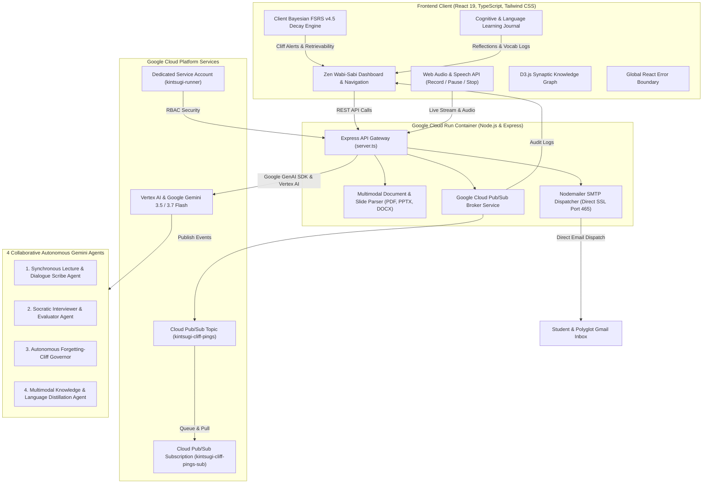

# 🌸 Kintsugi Memory (金継ぎ)
### Autonomous Forgetting-Cliff Partner for Universal Knowledge & Language Mastery

[](https://opensource.org/licenses/MIT)
[](https://cloud.google.com)
[](https://ai.google.dev)

---

## 🏛️ The Kintsugi Philosophy: Proactive Cognitive Synthesis

In traditional spaced repetition (Anki, Flashcards, Quizlet), software is **passive**: it sits silent on your device waiting for you to remember to open it. When life gets busy, memory decay follows a steep biological power-law drop, leading to the *illusion of competence* (passively re-reading notes instead of forced generative recall).

**Kintsugi Memory** is an **autonomous, proactive cognitive partner** inspired by the Japanese art of *Kintsugi* (金継ぎ — repairing broken ceramics with gold lacquer). In cognitive neuroscience, when a memory trace begins to destabilize at the **Forgetting Cliff (retention < 70%)**, forced active retrieval triggers synaptic protein synthesis (Long-Term Potentiation), leaving the memory trace stronger than before.

Instead of waiting for user prompts, Kintsugi Memory acts autonomously:
1. **Continuous Bayesian FSRS Modeling**: Tracks retrievability curves for academic concepts, foreign language vocabulary, and sentence structures.
2. **Proactive Forgetting-Cliff Telegrams**: When a memory vessel approaches the 70% retention boundary, the agent proactively dispatches a Socratic challenge directly to your Gmail inbox and browser alerts via **Google Cloud Pub/Sub**.
3. **Conversational Socratic Voice & Text Tutor**: Conducts live verbal and text dialogues, evaluates nuances, identifies subtle misconceptions, and highlights the *Golden Insight* (the gold joinery).
4. **Synchronous Speech & Slide Scribe**: Listens to live lectures, conversations, or language classes with **Record / Pause / Resume / Stop** controls, aligning speech transcripts with slide decks (PDF, PPTX, DOCX) to distill atomic knowledge vessels.
5. **Cognitive & Polyglot Learning Journal**: A dedicated journal for recording vocabulary nuances, grammar invariants, pronunciation observations, and philosophical reflections.

---

## 📐 System Architecture Diagram



---

## 🌐 Designed for Universal Learning & Polyglots

### 1. 🗣️ Language Acquisition & Polyglot Fluency
- **Vocabulary in Context**: Memorize words not in isolation, but attached to cultural nuances and syntactic patterns.
- **Grammar Invariant Dissection**: Master subtle boundaries that trip up learners (e.g. Japanese `〜わけにはいかない` vs `〜ざるを得ない`, Spanish Indicative vs Subjunctive triggers, Mandarin `把字句` constructions).
- **Spoken Socratic Retrieval**: Practice speaking sentences aloud with real-time speech recognition and text-to-speech feedback.

### 2. 🎓 Academic & Engineering Concepts
- Distill distributed consensus (Raft, Paxos, 2PC), machine learning memory bounds (KV Cache, FlashAttention), neurobiology of memory, and quantum systems into atomic vessels.

### 3. 📖 Universal Document & Audio Ingestion
- Upload PDF research papers, PowerPoint slide decks (`.pptx`), Word documents (`.docx`), whiteboard photos, or live recorded lectures (`.mp3`, `.wav`, `.m4a`, `.webm`).

---

## ⚡ Core Platform Capabilities

| Feature | Description |
|---|---|
| **🎙️ Live Scribe Studio** | Record lectures or language conversations with **Record**, **Pause / Resume**, and **Stop & Finalize** controls. Extracts speaker-diarized transcripts and slide alignments. |
| **📬 Autonomous Cliff Governor** | Background agent calculating Bayesian FSRS decay $R(t) = (1 + \text{factor} \cdot \frac{t}{S})^{-d}$. Dispatches email alerts when retrievability drops to 70%. |
| **🥋 Socratic Voice Tutor** | Verbal retrieval sessions evaluating accuracy, isolating misconceptions, and delivering *Golden Insights*. |
| **📔 Cognitive Journal** | Full reflective space for logging language grammar rules, sentence formulations, and daily synaptic breakthroughs. |
| **🕸️ D3 Synaptic Knowledge Graph** | Interactive, force-directed graph visualizing concept stability, inter-concept links, and forgetting risks. |
| **🔥 Synaptic Streak Continuum** | Power-law streak tracking, milestone rewards, and interactive 7-day practice calendar. |

---

## 🚀 Personal Deployment & Setup Guide

### Option 1: Local Development (Fastest)

#### 1. Clone & Install Dependencies
```bash
git clone https://github.com/rafifernandaa/kintsugi-memory.git
cd kintsugi-memory
npm install
```

#### 2. Configure `.env`
```bash
cp .env.example .env
```

Edit your `.env`:
```env
PORT=3000
GEMINI_API_KEY=your-gemini-api-key-here
GOOGLE_CLOUD_PROJECT=my-project-31-491314
GOOGLE_CLOUD_PUBSUB_TOPIC=projects/my-project-31-491314/topics/kintsugi-cliff-pings
GOOGLE_CLOUD_PUBSUB_SUBSCRIPTION=kintsugi-cliff-pings-server-sub

# Optional: Real Gmail Delivery (can also be configured directly inside the web UI)
SMTP_USER=your-email@gmail.com
SMTP_PASS=your-16-char-google-app-password
```

#### 3. Start Application
```bash
# Production Build & Run
npm run build
npm start

# Or for hot-reloading dev mode:
npm run dev
```

Open `http://localhost:3000` (or `http://localhost:5173` for Vite dev server) in your browser.

---

### Option 2: Personal Google Cloud Run Deployment

#### On Linux / macOS / Google Cloud Shell:
```bash
# 1. Login and set your GCP project
gcloud auth login
gcloud config set project YOUR_PROJECT_ID

# 2. Make script executable and run deployment
chmod +x deploy-cloudrun.sh
./deploy-cloudrun.sh
```

#### On Windows PowerShell:
```powershell
.\deploy-cloudrun.ps1
```

The script automatically:
1. Enables required Google Cloud APIs (`aiplatform`, `run`, `pubsub`, `speech`).
2. Creates the dedicated IAM service account `kintsugi-runner`.
3. Sets up the Google Cloud Pub/Sub topic `kintsugi-cliff-pings`.
4. Builds the container and deploys it to **Google Cloud Run** in `us-west1`.

---

### Option 3: Run with Docker Locally

```bash
# 1. Build Docker image
docker build -t kintsugi-memory .

# 2. Run container
docker run -p 3000:3000 --env-file .env kintsugi-memory
```

---

## 🧪 Testing & Verification Guide

1. **Test Live Audio Scribe**: Go to **Materials (Scribe)**, click **"Record Live Class Audio"**, speak into the mic, test **"Pause"** and **"Resume"**, and click **"Stop & Finalize"**.
2. **Test Forgetting Cliff Simulation**: Go to **Insights** or **Garden**, click **`+30d Month Cliff`** to simulate 30 days of memory decay.
3. **Test Direct Email Delivery**: Go to **Insights**, click **"Configure App Password"** or **"Send Test Email"**, and check your Gmail inbox at [mail.google.com](https://mail.google.com).
4. **Test Cloud Pub/Sub**: In Google Cloud Shell, pull published messages:
   ```bash
   gcloud pubsub subscriptions pull kintsugi-cliff-pings-sub --auto-ack --limit=5 --project=YOUR_PROJECT_ID
   ```

---

## 📄 License

Distributed under the **MIT License**. Crafted with wabi-sabi aesthetics and cognitive science for learners everywhere.

